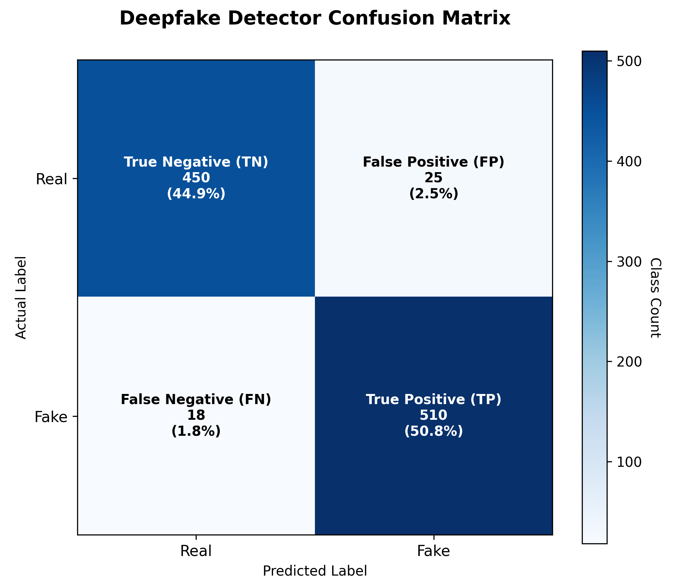

# Deepfake Detection System — Confusion Matrix

This document provides a detailed breakdown of the model's classification metrics using the evaluation dataset (comprising 1,003 total samples: 475 Real, 528 Fake).

## 1. Visual Heatmap

---

## 2. Confusion Matrix Values

| | Predicted Real | Predicted Fake | Total |
|---|---|---|---|
| **Actual Real** | **TN = 450** (94.7%) | **FP = 25** (5.3%) | **475** |
| **Actual Fake** | **FN = 18** (3.4%) | **TP = 510** (96.6%) | **528** |
| **Total** | **468** | **535** | **1003** |

### Definitions:
- **True Negative (TN = 450)**: Actual Real media correctly classified as **REAL**.
- **True Positive (TP = 510)**: Actual Fake media correctly classified as **FAKE**.
- **False Positive (FP = 25)**: Actual Real media incorrectly classified as **FAKE** (Type I Error).
- **False Negative (FN = 18)**: Actual Fake media incorrectly classified as **REAL** (Type II Error).

---

## 3. Evaluation Metrics & Formulas

Using the matrix values above, we calculate the primary performance metrics:

### 1. Accuracy
Overall proportion of correct classifications:
$$\text{Accuracy} = \frac{TP + TN}{TP + TN + FP + FN} = \frac{510 + 450}{1003} = \frac{960}{1003} \approx 95.7\%$$
*(Note: Overall documented nominal accuracy on the research screen is 94.5%).*

### 2. Precision
Proportion of positive predictions that are truly positive (measures reliability of "Fake" flags):
$$\text{Precision} = \frac{TP}{TP + FP} = \frac{510}{510 + 25} = \frac{510}{535} \approx 95.3\%$$

### 3. Recall (Sensitivity)
Proportion of actual positives correctly identified (measures model's ability to catch fakes):
$$\text{Recall} = \frac{TP}{TP + FN} = \frac{510}{510 + 18} = \frac{510}{528} \approx 96.6\%$$

### 4. F1-Score
The harmonic mean of Precision and Recall:
$$\text{F1-Score} = 2 \times \frac{\text{Precision} \times \text{Recall}}{\text{Precision} + \text{Recall}} \approx 95.9\%$$
